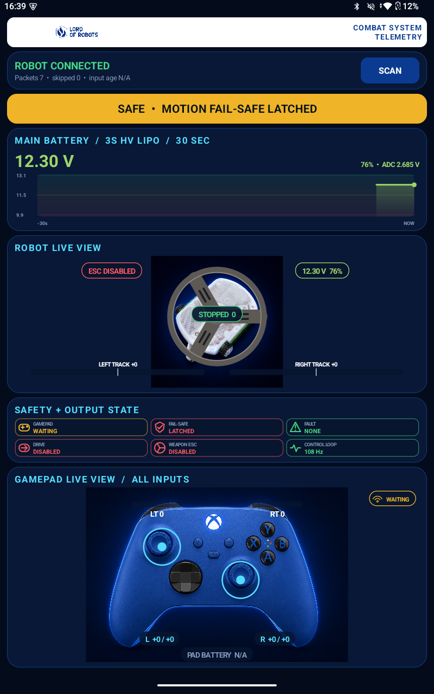
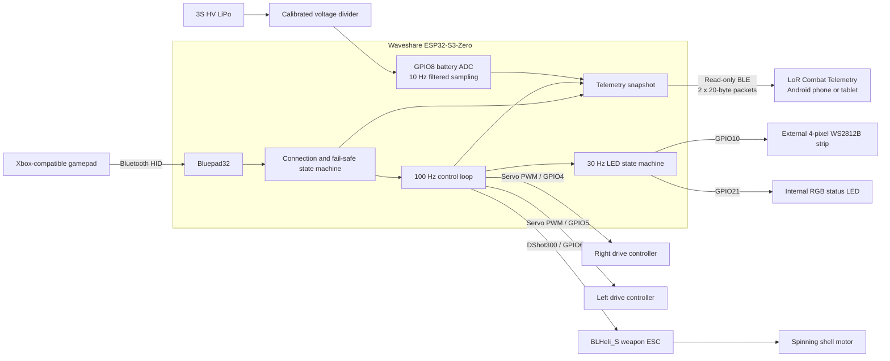

# LoR Telemetry App

Firmware and a read-only Android telemetry dashboard for a Lord of Robots spinning-shell combat robot. The robot uses a Waveshare ESP32-S3-Zero, an Xbox-compatible gamepad, tank-style drive, and a bidirectional LANRC 45 A BLHeli_S weapon ESC running DShot300.



## Project overview

This repository contains the complete robot firmware and companion Android application. The ESP32-S3 remains the only robot controller: it receives gamepad input, runs the safety logic, commands the drive and weapon systems, monitors the main battery, controls both LED systems, and broadcasts read-only BLE telemetry. The phone or tablet only displays data and cannot arm or control the robot.

Key features:

- 100 Hz non-blocking robot control and safety loop
- Tank drive with 75% forward/reverse limit and 50% steering authority
- Proportional forward and reverse weapon control over DShot300
- Disconnect, boot, reconnect, and abnormal-reset motion interlocks
- GPIO8 voltage monitoring calibrated for a 3S HV LiPo
- Independent 30 Hz internal and external LED state machines
- Read/notify-only Bluetooth Low Energy telemetry
- Responsive, branded Android dashboard that fits one screen without scrolling
- Live robot, gamepad, motor, ESC, safety, connection, and battery visualization

## System diagram



The phone connection is deliberately outside the control path. The BLE service exposes robot and controller state through read/notify characteristics; it does not define a command characteristic.

## Repository contents

| Path | Purpose |
|---|---|
| `firmware/LoR_Combat_SSS_2608050002_battery_dashboard/` | ESP32-S3 Arduino sketch and supporting C++ modules |
| `android-dashboard/` | Native Java Android application, resources, and standalone PowerShell build script |
| `android-dashboard/output/LoR-Telemetry-debug.apk` | Prebuilt debug APK for Android 12 or newer |
| `docs/` | Architecture, hardware, build, BLE protocol, and fail-safe documentation |

## Firmware and code

### Main robot sketch

`LoR_Combat_SSS_2608050002_battery_dashboard.ino` owns the complete real-time robot state:

- Bluepad32 gamepad connection callbacks and input processing
- first-report and 500 ms neutral-hold release interlock
- left and right drive mixing, output limiting, slew control, and reversal dwell
- proportional weapon command, acceleration/braking ramps, and reversal dwell
- GPIO8 battery sampling, filtering, voltage conversion, and percentage estimate
- 30 Hz external-strip and internal-status LED animations
- task watchdog, abnormal-reset detection, persistent fault state, and debug output
- construction and publication of robot and controller telemetry snapshots

`WeaponDShot300.cpp/.h` generates DShot300 frames for GPIO6. The BLHeli 3D mapping is:

- `0`: digital stop
- `48..1047`: reverse
- `1048..2047`: forward

`RobotTelemetryBle.cpp/.h` defines the custom BTstack GATT service, advertising, connection handling, fixed packet structures, and alternating notification scheduler. Each robot and controller characteristic updates at 10 Hz while a gamepad is connected and 2 Hz while waiting.

### Control mapping

| Gamepad input | Robot function |
|---|---|
| Left stick Y | Forward/reverse tank drive, limited to 75% of the previous top speed |
| Right stick X | Steering, reduced to 50% turn authority |
| Right trigger | Proportional forward weapon command |
| Left trigger | Proportional reverse weapon command/braking |
| A | Forward weapon idle preset |
| B | Stop weapon |
| X | Reverse weapon idle preset |

Weapon trigger input uses the full `-1024..1024` combined range and maps to the complete configured bidirectional ESC command range.

### Safety behavior

1. Drive PWM and weapon DShot start disabled.
2. A newly connected gamepad must send a real input report.
3. Drive, steering, and both weapon triggers must remain neutral for 500 ms.
4. Drive outputs attach and the weapon ESC receives a three-second DShot STOP arming dwell.
5. A gamepad disconnect immediately clears all requested and ramped commands, commands neutral/STOP, detaches both drive PWM outputs, and disables weapon DShot after a STOP burst.
6. Reconnection cannot restore an old command; the complete first-report and neutral-hold sequence runs again.
7. A one-second task watchdog resets a stalled control loop. Watchdog, panic, brownout, and unknown resets create a persistent fault that keeps motion disabled for that boot.

Xbox HID reports can be event-driven while an input is held steady, so controller report age is diagnostic only. Disconnect shutdown begins when Bluepad32 reports link loss. The remaining physical and firmware limitations are documented in [Final fail-safe review](docs/SAFETY_REVIEW.md).

### Hardware map

| GPIO | Function | Interface |
|---:|---|---|
| 4 | Right drive controller | Servo-style PWM |
| 5 | Left drive controller | Servo-style PWM |
| 6 | Weapon ESC | DShot300 |
| 8 | Main battery monitor | ADC through calibrated divider |
| 10 | Four-pixel external strip | WS2812B |
| 21 | Internal status LED | Addressable RGB |

The current battery calibration is based on a measured 12.000 V input producing 2.621 V at GPIO8, for an effective divider ratio of 4.5784:1. Battery percentage maps 9.90 V to empty and 13.05 V to full for a 3S HV LiPo. See [Hardware and wiring](docs/HARDWARE.md) before connecting the pack.

### LED states

- Internal GPIO21 LED is green when the weapon output is disabled and red when it is enabled.
- After a controller disconnect, the external strip flashes red for three seconds.
- While waiting for a gamepad, the strip runs a smooth, fast blue/white animation.
- With a gamepad connected and the weapon stopped, a broad green orb eases and bounces across the physical four-LED line.
- With the weapon moving, a two-color rainbow wash accelerates with weapon speed.
- Reverse weapon motion adds a 2 Hz flash to the rainbow animation.

## Android user interface

The dashboard is a native Java Android application with no Gradle or network dependency downloads. It targets Android 12+ and automatically scales its one-screen layout for phones and tablets while respecting the status and navigation bar insets.

### Dashboard regions

| Interface region | Information shown |
|---|---|
| Header | Lord of Robots branding, BLE connection state, and packet activity |
| Robot status card | One bold, full-width state line; green for nominal, yellow for warning/safe states, and red for errors |
| Main battery | Live voltage, estimated percentage, GPIO8 ADC voltage, condition color, and rolling 30-second graph |
| Robot live view | Stationary white body, shell rotation mapped to weapon speed/direction, drive direction/strength, and weapon state |
| Safety + output state | Compact visual tiles for gamepad, fail-safe, persistent fault, drive, weapon ESC, and control-loop health |
| Gamepad live view | Connection icon, both sticks, both triggers, D-pad, shoulders, stick clicks, standard buttons, misc buttons, and raw values |

### Status logic

The top status card prioritizes the most important active condition:

- red: persistent system fault, critical battery, stale telemetry, or BLE errors
- yellow: fail-safe latched, gamepad disconnected, battery monitor offline, low battery, or weapon ESC arming
- green: robot ready or weapon running

Weapon ESC enabled is shown in green and disabled in red. The app marks telemetry stale after 1.6 seconds without a robot packet.

### Android code map

| Source file | Responsibility |
|---|---|
| `MainActivity.java` | Permissions, BLE scan/connect/subscription flow, responsive dashboard layout, packet routing, and state prioritization |
| `TelemetryPacket.java` | Decodes the 20-byte robot telemetry packet |
| `ControllerTelemetryPacket.java` | Decodes the 20-byte controller telemetry packet |
| `BatteryGraphView.java` | Draws the condition-colored rolling 30-second voltage graph |
| `RobotTelemetryView.java` | Draws live robot drive and spinning-shell visualization |
| `GamepadTelemetryView.java` | Draws every gamepad input and connection state over the controller image |
| `SafetyTelemetryView.java` | Draws the compact six-tile safety and output panel |

The app scans for the BLE device name `LoR SSS Telemetry`. Only one phone or tablet telemetry connection is supported at a time.

## BLE telemetry

Service UUID: `8b7d0001-3f9b-4f6f-8d6a-11f6a3c80001`

| Characteristic | UUID suffix | Contents |
|---|---|---|
| Robot | `0002` | Flags, sequence, loop rate, battery/ADC voltage, drive commands, weapon command, DShot value, report age, and battery percentage |
| Controller | `0003` | Sequence, D-pad, controller battery field, four axes, both triggers, standard buttons, and misc buttons |

Both characteristics are fixed 20-byte little-endian packets and are read/notify-only. See [BLE telemetry protocol](docs/TELEMETRY_PROTOCOL.md) for byte offsets, types, flags, and calibration details.

## Build and install

### Firmware

Requirements include Arduino CLI or Arduino IDE, Bluepad32 ESP32 board package, FastLED, and ESP32Servo.

```powershell
arduino-cli compile --fqbn esp32-bluepad32:esp32:esp32s3 .\firmware\LoR_Combat_SSS_2608050002_battery_dashboard
arduino-cli upload -p COM10 --fqbn esp32-bluepad32:esp32:esp32s3 .\firmware\LoR_Combat_SSS_2608050002_battery_dashboard
```

Change `COM10` if Windows assigns another port. Remove the physical weapon power link before flashing or bench testing.

### Android app

Install Android SDK platform/build tools and a JDK, set `ANDROID_SDK_ROOT` or `ANDROID_HOME`, then run:

```powershell
powershell -ExecutionPolicy Bypass -File .\android-dashboard\build.ps1
```

The script discovers the newest installed Android platform and build-tools version, generates a local debug keystore if required, builds the APK, signs it, and verifies the signature. Output:

```text
android-dashboard\output\LoR-Telemetry-debug.apk
```

Install with Android Debug Bridge:

```powershell
adb install -r .\android-dashboard\output\LoR-Telemetry-debug.apk
```

Detailed prerequisites, upload recovery, connection steps, and signing notes are in [Build, flash, and install](docs/BUILD_AND_INSTALL.md).

## Verified configuration

- Board target: `esp32-bluepad32:esp32:esp32s3`
- Bluepad32 ESP32 platform: 4.1.0
- ESP32Servo: 3.2.1
- FastLED: 3.10.3
- Firmware usage: 678,957 bytes flash (51%) and 70,336 bytes RAM (21%)
- Android compile: successful
- APK signing: Signature Scheme v3 verified

## Additional documentation

- [System architecture](docs/ARCHITECTURE.md)
- [Hardware and wiring](docs/HARDWARE.md)
- [Build, flash, and install](docs/BUILD_AND_INSTALL.md)
- [BLE telemetry protocol](docs/TELEMETRY_PROTOCOL.md)
- [Final fail-safe review](docs/SAFETY_REVIEW.md)

## Important safety note

Combat-robot software is not a substitute for a physical weapon power link, a restrained test fixture, and an accessible master disconnect. Remove weapon power before changing wiring, programming the controller, or working near the shell.
